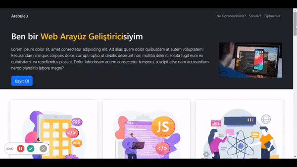

# Eğitim Web Sitesi
- Bu proje, Front-end Web Geliştiricisi olmak isteyenlerin başlangıç seviyesinde ihtiyaç duyacakları temel web teknolojilerini öğrenmeleri için hazırlanmış bir eğitim web sitesidir.

### İçerik
-
  > Projede ,HTML,CSS ve Javascript kullanıldı. Projenin temel amacı Boostrap gibi popüler bir CSS  kütüphanesini kullanarak bir web sitesi tasarlamaktır.Projenin tasarımı tamamiyle Boostrap stil özellikleri ile oluşturuldu.

#### Önizleme
- Web sitesini görmek için link :  [egitimweb](https://egitimweb.netlify.app/) adresini ziyaret edebilirsiniz.

- 
